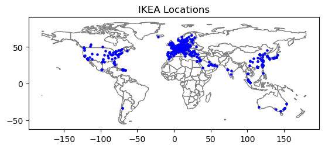
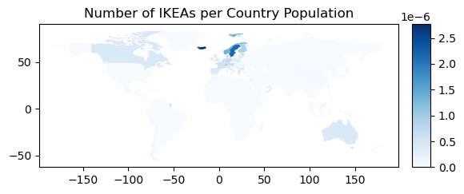
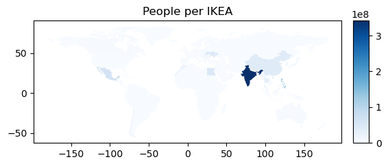

# IKEA_Location
I did a small project to practice using https://nominatim.openstreetmap.org and GeoPandas.
Since I am located in Sweden, I thought it would be fun to plot the location of
every IKEA warehouse.

# Data Collection
I found this wikipedia article that lists all of the countries with IKEA stores. I then looked at the official IKEA webpage for each country to get the address of each store. I manually
added these to my file. I used my python script find_lat_long.py to look for the latitude and longitude of each store based on its address. This worked well for many countries. When the languages were significantly different from English, this did not work well. In that case, I had to manually find the latitude and longitude from Google Maps.

China was an especially difficult country. Google maps is not often used there and the information on Google was unreliable. Additionally, there were many stores listed as IKEAs on google maps, such as “IKEA leisure hotel”, “IKEA Northeast Speciality Food Supermarket”, “IKEA supermarket”, “Esteem Ikea Home Textile Discount Factory”, “Ikea Convenience Store”, “IKEA heating”, and “IKEA wine and cigarette.” I am not sure if the name IKEA isn’t protected in China, so many stores were using it, or if they were spurious listings on Google Maps.

# Results

This is a map with all the IKEAs in the world. There are many IKEAs in Europe and
they are not very far away from each other. There is only one IKEA in South America
(in Chile). There are 3 in Africa (all in Egypt). There were 13 IKEA stores in Russia,
but they all closed last year because of Russia’s attack on Ukraine.

Germany has 55 IKEAS, which is the highest number of IKEAs of any country, 
but with a population of 83,132,799, there are 1,511,505 people per IKEA.
Iceland has 361,313 people and 1 IKEA, so they have the fewest number of people per IKEA buildings.
Sweden has the second highest number of IKEAs per population, with 1 for every
467,520 people. 

The previous graph was the number of IKEAs per population. If I flip this and calculate 
the number of IKEAs per people living in a country, we can see that India has many people
without proper access to IKEA. There are only 3 IKEAs in India. This looks like a business 
opportunity for IKEA. South America and Afric also look like they could use more IKEAs based 
on the IKEA density per continent. 
